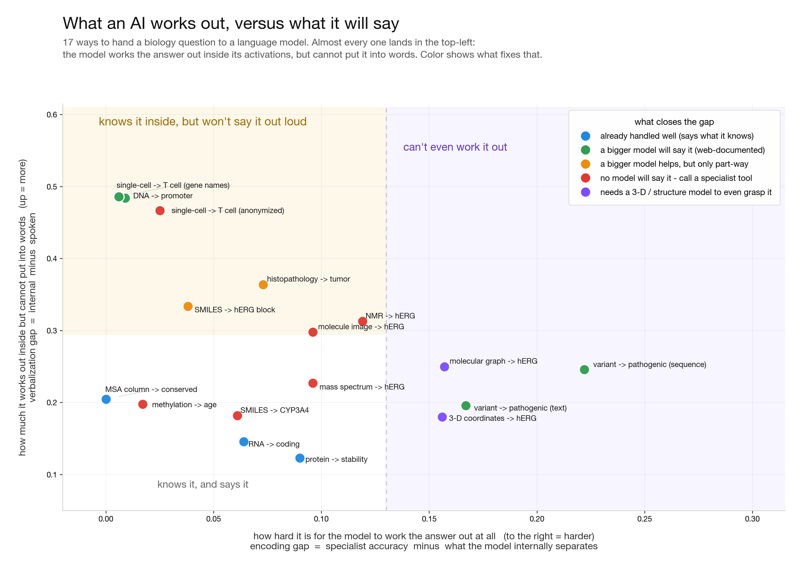

# grounding-atlas

[](https://github.com/jang1563/grounding-atlas/actions/workflows/ci.yml)
[](LICENSE)
[](DATA_SOURCES.md)


**Contents:** [Why](#why-this-project-exists) · [Thesis](#the-thesis-one-line) · [Workstreams](#three-workstreams) · [Results at a glance](#results-at-a-glance) · [Artifact map](#artifact-map) · [Repository map](#repository-map) · [Dataset](#companion-hugging-face-dataset) · [Setup](#setup) · [Cite](#cite) · [Scope & claims](#scope-and-claims)

**Does a language model do biology by the *content* of a specialist model's output (sequence, structure, identifier, numeric prediction), or just by its *name*? Measure it, manufacture verifiable signal to close it, and map where each capability should live.**

**Bottom line:** open-weight probes often recover linearly decodable biological signal that the same
open model does not verbalize, while frontier-model output varies with token familiarity, reasoning
capacity, and mapping documentation. The a-priori `web` tag is a useful routing prior, not a universal
law or a substitute for model- and task-specific validation.



A measurement-first research project toward a **grounded biology orchestrator**. Capability-focused (make a model better at biology), not safety. Builds on and unifies several of my own prior projects (a frozen-embedding separability study, an LLM over-trust instrument, NullAtlas/NegBioRL, LabCraft).

*Author: **JangKeun Kim** — Senior Research Associate and Director of Spaceflight Research at Weill Cornell Medicine (Mason Lab). Research areas: single-cell and spatial genomics, space biology, and AI evaluation in biology. [github.com/jang1563](https://github.com/jang1563)*

Status: **active execution** (updated 2026-07-02; the tracked GroundBench registry, exported Parquet,
and leaderboard contain 24 tasks / 9 modalities / 3 models plus a cheap-head baseline; see
[`docs/GROUNDBENCH.md`](docs/GROUNDBENCH.md)). The instrument has produced pilot results across small
molecules, proteins, variants, methylation, histopathology, single-cell data, and other representations.
The generative train-vs-guidance study found no separation at moderate query budgets, while a
high-budget cell produced a modest, seed-variable RL edge that remained below the pre-registered
overturn threshold. These are measured regimes, not a universal train-vs-route rule.

| Component | State |
|---|---|
| WS1 instrument (encode vs verbalize) | built; 17 representations measured on one 3-arm instrument |
| WS2 verifiable-signal generators | ~18 modality families |
| WS3 placement + calibration | measured: train/retrieve/orchestrate map + per-item routing |
| WS3 generative extension (RL environment) | pre-registered 3-arm generative head-to-head; formal CIs across 3 reward-quality cells (Cayuga + SDSC Expanse) |
| Scale | pilot (n ~80-1500 per rung); ceilings are cheap specialists or cited foundation models |

---

## Artifact map

| Surface | Human entry point | Machine-readable entry point |
|---|---|---|
| **Visual report** | [`docs/report.html`](docs/report.html) — the one-page map: measured effects, routing results, and the generative extension | self-contained HTML (no external assets) |
| GitHub source | [`github.com/jang1563/grounding-atlas`](https://github.com/jang1563/grounding-atlas) | [`pyproject.toml`](pyproject.toml), [`codemeta.json`](codemeta.json), [`CITATION.cff`](CITATION.cff) |
| Hugging Face dataset | [`datasets/jang1563/grounding-atlas`](https://huggingface.co/datasets/jang1563/grounding-atlas) | Parquet configs with dataset-card YAML front matter |
| Results | [`results/SYNTHESIS.md`](results/SYNTHESIS.md), [`results/README.md`](results/README.md) | sibling `.json` / `.jsonl` files under [`results/`](results/) |
| GroundBench | [`docs/GROUNDBENCH.md`](docs/GROUNDBENCH.md) (run it), [`docs/GROUNDBENCH_SPEC.md`](docs/GROUNDBENCH_SPEC.md) (contract), [`results/benchmark/LEADERBOARD.md`](results/benchmark/LEADERBOARD.md) | [`eval/run_grounding_eval.py`](eval/run_grounding_eval.py) (`--model X`); per-model `scorecard.json` / `manifest.json` / `raw.jsonl` + `LEADERBOARD.md` |
| Data provenance | [`DATA_SOURCES.md`](DATA_SOURCES.md) | per-config source/license table plus HF card metadata |
| Safety and exclusions | [`SECURITY.md`](SECURITY.md) | explicit gitignore boundaries for secrets, raw DBs, and excluded generated scores |

---

## GroundBench: run it on your model

The benchmark surface of this project is **GroundBench**: 24 tasks across 9 modalities x 3 models, plus a
reproducible cheap-head baseline, on one GPU-free output-arm harness. The leaderboard
([`results/benchmark/LEADERBOARD.md`](results/benchmark/LEADERBOARD.md)) is organized by the a-priori
web-exposure tag. It is a useful prior: many `web=zero` rows sit near chance and many `web=rich` rows
ground, but documented exceptions show that it is necessary-not-sufficient. The cheap-head column
tests whether a lightweight specialist can recover signal when model output is weak.

```bash
pip install -e .
export ANTHROPIC_API_KEY=...   # or OPENAI_API_KEY, or OPENAI_BASE_URL for any OpenAI-compatible server
python eval/run_grounding_eval.py --model claude-opus-4-8     # or --dry-run to validate with no API
```

Quickstart and bring-your-own-model instructions: [`docs/GROUNDBENCH.md`](docs/GROUNDBENCH.md). Task
schema, adding a task, and the mandatory orientation audit: [`docs/GROUNDBENCH_SPEC.md`](docs/GROUNDBENCH_SPEC.md).
Putting your model on the leaderboard: [`SUBMITTING.md`](SUBMITTING.md).

## Why this project exists
The grounding gap is real: models recognize a biological entity by name far more reliably than they resolve or ground its concrete content — sequence, database accession, numeric representation — a name-vs-content recognition gap established in a prior recognition study, plus the question of whether the model surfaces what a probe reads from a representation (encoding vs expression). Closing it is a genuine path to a better science model.

It is also a distinct layer in the agentic-bio stack. Adjacent evals measure other things: BioMysteryBench measures task solve-rate through tools, and gget virus / VirBench (2026-06-08) measures agent retrieval accuracy against deterministic ground truth. Neither measures whether the model grounds the *content* of what a specialist emits, nor whether it calibrates trust on that output. The complementary chain is **retrieval -> content-grounding (this project) -> downstream**.

## The thesis (one line)
A science model is only as good as it grounds the *content* of a specialist model's output, not its *name*. Today that grounding is decided by assertion. This project makes it measured.

## Three workstreams
- **WS1 - the instrument (MEASURE).** Does the model ground a representation by content or by name? The core is the content-grounding axis (probe-vs-LLM + LLM-activation probe + content-sensitivity), with identity-resolution and channel/action-policy as measured supporting axes. Deterministic, non-LLM-judge, matched controls. Negative-evidence coverage is NullAtlas's (WS2), cited not absorbed.
- **WS2 - the engine (MAKE SIGNAL).** Extend the negative-evidence approach to grounding: generate matched (representation, verifiable-property) pairs where the representation itself is the ground truth, so grounding becomes trainable/evaluable where positive-only literature gives no signal. The ADMET and computable pairs (55,703 rows) are packaged as a public dataset, [`jang1563/grounding-atlas`](https://huggingface.co/datasets/jang1563/grounding-atlas) (CC BY-SA 4.0).
- **WS3 - the decision map (MAP THE LINE).** Per capability, compare train (weights), retrieve (MCP/RAG), and orchestrate (call the SFM). In the measured discriminative cells, retrieval or specialist orchestration matched or exceeded in-weight adaptation. In the generative study, train and guidance tied at moderate budget, while a high-budget cell showed a modest, seed-variable RL edge. See [`docs/REPORT.md`](docs/REPORT.md).

Full design: `PROJECT_DESIGN.md`.

## Results at a glance

*Pilot-scale; see [`results/SYNTHESIS.md`](results/SYNTHESIS.md) for the full 17-representation master table and caveats, and [`results/`](results/README.md) for every writeup.*

**Open-model encoding probes and model output are distinct evidence streams.** In the 17-representation
research sweep, open-weight linear probes often approach a specialist ceiling while the corresponding
open-model output is weaker. Frontier systems are evaluated on output and routing because their hidden
states are unavailable. The repository therefore does **not** establish a same-model
encode-plus-verbalize result for the frontier models on the GroundBench leaderboard. Across the output
studies, token familiarity/reasoning and mapping documentation contribute in a capability-dependent
mix; the `web` tag predicts part of the floor but is not a single causal axis.

| representation → property | ceiling | open-model probe | reported output | reads out? |
|---|---|---|---|---|
| MSA column → conserved | 0.999 | 1.000 | 0.795 | grounds (web-rich) |
| single-cell → T cell (gene names) | 0.989 | 0.983 | 0.50 → opus 0.99 | closes with scale |
| single-cell → T cell (anon ids) | 0.989 | 0.964 | 0.497 | invariant (web-zero) |
| methylation → age | 0.701 | 0.685 | 0.487 | invariant (web-zero numbers) |
| histopathology H&E → tumor | ~0.90 | 0.827 | 0.463 | partial, plateau ~0.65 |
| 3D coords → hERG | 0.826 | 0.669 | 0.490 | encoding-limited |

> **A useful matched comparison.** Methylation and MSA use similar binary task shapes and both have
> strong open-model probe results, while their reported outputs differ (MSA 0.795; methylation 0.487).
> This comparison is consistent with a mapping-documentation contribution, but it is not a controlled
> proof that documentation is the only cause. The single-cell name/anon studies further show that token
> familiarity and reasoning contribute differently as model capability changes.

**The prescription.** Because the frontier is *calibrated* about where it grounds (opus self-confidence tracks actual grounding at corr +0.90), the same map is a routing policy. Confidence is good at *knowing when it cannot* — it defers the web-zero tasks — but against **real per-item specialists** it does **not** reach the per-item oracle: routed 0.81 vs oracle 0.91, because self-confidence cannot flag the ~10% of items where the LLM beats the specialist. (An earlier per-rung figure — routing 0.893 ≈ oracle 0.894 — was a ceiling-as-specialist upper bound, corrected in [`calibration_discovery/`](calibration_discovery/results/RESULTS.md).) The durable, model-free win is the **a-priori web-exposure tag**: known before any model call, it is a competitive deferral prior in its own right. Details in [`results/calibration_routing.md`](results/calibration_routing.md) and [`results/decision_map_placement.md`](results/decision_map_placement.md).

**The generative regime.** A pre-registered molecular-generator study compared internalized RL with
external inference-time guidance at matched reward-query budgets. The arms were statistically tied in
the moderate-budget and reward-quality cells. At high budget, pooled RL exceeded guidance, but the
effect was seed-variable and its confidence-interval lower bound missed the pre-registered overturn
margin. The result is budget-dependent and does not license a universal train-vs-route conclusion.
Design and result: [`docs/RL_ENV_PREREG.md`](docs/RL_ENV_PREREG.md),
[`results/benchmark/rl_env/v1_herg.md`](results/benchmark/rl_env/v1_herg.md), and
[`results/benchmark/rl_env/budget_sweep.md`](results/benchmark/rl_env/budget_sweep.md).

**The negative class too.** The same encode-but-cannot-verbalize gap holds for confirmed NEGATIVES (this compound is inactive / safe): an open 8B encodes confirmed-inactive near the Morgan ceiling yet verbalizes it at chance, replicated cross-family (Qwen3-8B + OLMo-2-7B), so the known "no negative data leads to excessive false positives" failure is itself an *expression* gap. See [`results/negative_expression_gap.md`](results/negative_expression_gap.md). The verifiability gate that certifies signal also generalizes to 19 modality cells (17/19 PASS) and doubles as a signal-side memorization detector that flags PPI-by-name as recall, not grounding ([`signal/verifiability_multimodal.md`](signal/verifiability_multimodal.md)).

## Repository map

**Documents**
| File | What |
|---|---|
| `PROJECT_DESIGN.md` | thesis, the gap, WS1-3 in detail, scope and honest caveats |

**Code and outputs**
| Path | What |
|---|---|
| `eval/` | WS1 instrument: probe-vs-LLM head-to-head, LLM-activation probe, content-sensitivity (`eval/README.md`) |
| `signal/` | WS2 verifiable-signal generators across ~18 modality families (admet, affinity, methyl, msa, ppi, single_cell, structure3d, computable, ...) |
| `decision_map/` | WS3 train / retrieve / orchestrate placement |
| `calibration_discovery/` | per-item selective-prediction / calibration extension |
| `protein_grounding/`, `variant_grounding/` | modality branches (each with own `data/`, `eval/`, `results/`) |
| `results/` | measured outputs: writeups (`.md`), data (`.json`/`.jsonl`), figures (`.png`) |
| `docs/` | design docs, failure-mode taxonomy, the field message |
| `data/` | shared curated inputs (large/re-fetchable reference DBs are gitignored) |

## Companion Hugging Face dataset

The public companion dataset is [`jang1563/grounding-atlas`](https://huggingface.co/datasets/jang1563/grounding-atlas). The default config contains 55,703 uniform ADMET + computable rows; the additional configs expose modality-specific rungs as Parquet tables.

```python
from datasets import load_dataset

ds = load_dataset("jang1563/grounding-atlas", split="train")
methyl = load_dataset("jang1563/grounding-atlas", "methyl", split="train")
cells = load_dataset("jang1563/grounding-atlas", "single_cell", split="train")
```

Use the GitHub repository for the measurement instrument and result writeups; use the Hugging Face dataset for training/evaluation rows, schema inspection, and downstream loaders.

## Where to start (reading order)
1. [`results/SYNTHESIS.md`](results/SYNTHESIS.md) - the 17-representation research sweep, its caveats, and the routing implications.
2. [`docs/field_message.md`](docs/field_message.md) - the framing: a frontier model's job is to ground and route, not to know.
3. [`PROJECT_DESIGN.md`](PROJECT_DESIGN.md) - the full design and the three workstreams.
4. [`eval/README.md`](eval/README.md) and [`signal/README.md`](signal/README.md) - the instrument and the signal generators; [`results/`](results/README.md) and [`docs/`](docs/README.md) index everything else.

## Setup

```bash
# 1. Dependencies (research code; versions unpinned)
pip install -e .            # light: runs GroundBench (output arm + cheap-head baseline), no GPU
pip install -e ".[full]"    # everything: regenerate signal, ceilings, activation probes, figures
#   (requirements.txt also pins the full stack, e.g. for the activation/probe GPU jobs)

# 2. Data. Large public reference DBs (AlphaMissense, ClinVar, UniProt,
#    ProteinGym DMS; ~2.3G) are gitignored and re-fetched by the branch
#    setup scripts under variant_grounding/eval/ and protein_grounding/eval/.
```

LLM clients read provider credentials from environment variables such as `ANTHROPIC_API_KEY` and `OPENAI_API_KEY`; keys are never committed. The activation/probe sweeps use GPU job templates under `eval/`.

## Cite

Machine-readable metadata is in [`CITATION.cff`](CITATION.cff) (GitHub renders a "Cite this repository" button). In short:

> JangKeun Kim. *grounding-atlas: a measurement-first map of biological content-grounding in language models.* 2026.

## Scope and claims
- **Capability-first, measurement-first.** The contribution is the instrument and the verifiable-signal substrate, not a multimodal model build; the same instrument also flags where a grounded model is unsafe.
- **What is novel vs cited.** The cross-representation grounding measurement and the signal engineering are the contribution; the train-vs-retrieve-vs-orchestrate framing and the encoding-vs-expression decomposition build on prior work (Ovadia 2312.05934; In-Tool Learning 2508.20755; NatureLM 2502.07527; Mozi 2603.03655; Inside-Out 2503.15299).
- **Numeric over-trust is a verbalization/calibration gap**, not an inability to represent numbers (the signal is in the activations). This is not extended to the ESM-2 probe result, which is an encoding question measured on the specialist, not the LLM.
- **Evidence streams are separated.** Hidden-state encoding claims come from open-weight probes;
  frontier models contribute output and routing results. Same-model frontier encode-plus-verbalize
  evidence is not established here.
- **Public-safe release.** The committed tree contains evaluation code, derived benchmark rows, and aggregate outputs; secrets, large re-fetchable databases, and excluded generated scores stay out of git (see [`SECURITY.md`](SECURITY.md)).

## License

Code is Apache-2.0 ([`LICENSE`](LICENSE)). The datasets (the `signal/` tables here and the companion Hugging Face dataset) are **CC-BY-SA 4.0**, because some ADMET labels derive from ChEMBL (CC-BY-SA, share-alike). Per-source attribution is in [`DATA_SOURCES.md`](DATA_SOURCES.md). AlphaGenome-derived scores are not redistributed (non-commercial terms).
