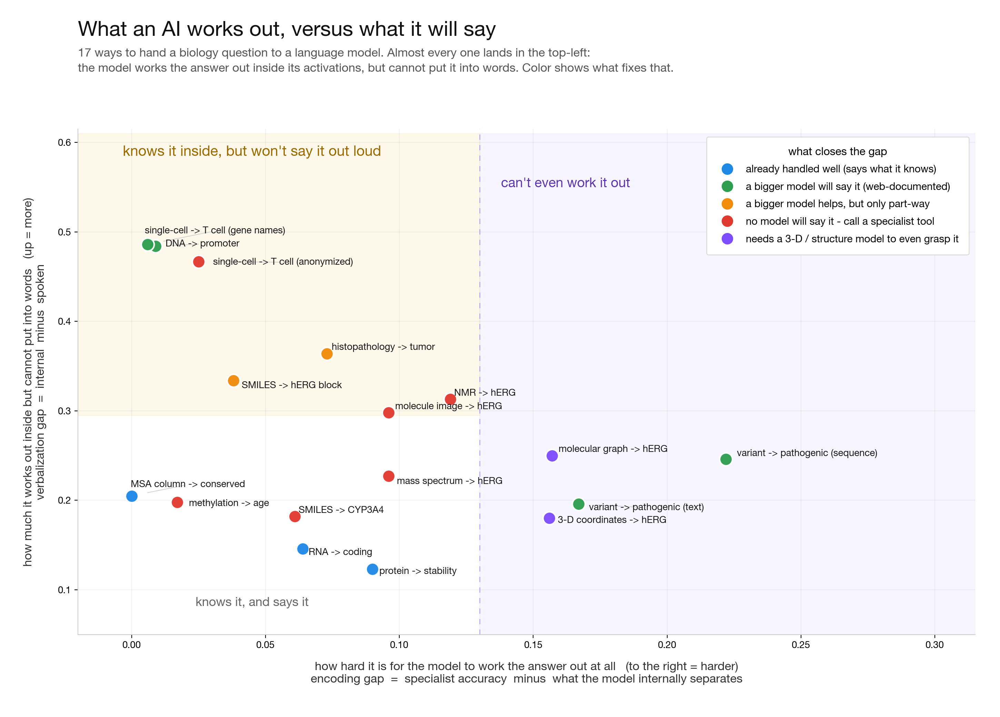

# Results index

Measured outputs of the grounding-atlas program. Each `.md` is a writeup; the
sibling `.json` / `.jsonl` are the machine-readable data behind it, and `.png`
are figures. **Start with [`SYNTHESIS.md`](SYNTHESIS.md)** — it ties all 17
representation rungs and the calibration axis into one law and one figure.

The one-line result: *LLMs **encode** far more biology than they **verbalize**;
the gap between the two is set by how web-documented the representation-to-property
mapping is, not by the modality; and because frontier models are calibrated about
this, the same web-exposure law that explains the failure also tells an
orchestrator when to trust the model and when to reach for a tool.*

## Start here
| File | What it shows |
|---|---|
| [`SYNTHESIS.md`](SYNTHESIS.md) | the descriptive law of grounding and the orchestrator it prescribes (master table, 17 representations) |
| `synthesis_figure.png` / `synthesis_figure_hires.png` | the two-axis (encoding gap vs verbalization gap) core figure |

## WS1 — the instrument (encode vs verbalize)
| File | What it shows |
|---|---|
| [`ceiling_gate.md`](ceiling_gate.md) | axis-B candidate screening: is the property decodable from the representation at all |
| [`head_to_head.md`](head_to_head.md) | probe vs LLM: encoding vs expression in hERG grounding |
| [`frontier_output_panel.md`](frontier_output_panel.md) | scale closes the expression gap in proportion to web-exposure |
| [`layer_profiles.md`](layer_profiles.md) | layer-resolved contrast of the two expression gaps |
| [`selection_bias.md`](selection_bias.md) | the encoding claim survives an unbiased best-layer choice |

## Per-modality rungs (the representation ladder)
| File | What it shows |
|---|---|
| [`msa_rung.md`](msa_rung.md) | MSA column conservation: positive control for the two-factor law |
| [`dna_promoter.md`](dna_promoter.md) | DNA/RNA promoter 3-arm |
| [`methylation_rung.md`](methylation_rung.md) | a web-zero numeric vector is encoded but not verbalized |
| [`single_cell_rung.md`](single_cell_rung.md) | the cleanest web-exposure result (gene-name vs anonymized ids) |
| [`histopath_rung.md`](histopath_rung.md) | the largest expression gap, in a vision model |
| [`image_rung.md`](image_rung.md) | molecular-image rung: the encoding-limited prediction fails for coarse hERG |
| [`spectra_rung.md`](spectra_rung.md) | simulated MS: a non-renderable modality is still expression-limited |
| [`structure3d_rung.md`](structure3d_rung.md) | hERG from raw XYZ coordinates: the encoding-limited candidate |
| [`sfm_embedding_rung.md`](sfm_embedding_rung.md) | can the LLM read a property out of a specialist's embedding |

## Controls (the gap survives every named confound)
| File | What it shows |
|---|---|
| [`confound_controls.md`](confound_controls.md) | the encoding-vs-expression gap survives every named confound |
| [`notation_control.md`](notation_control.md) | canonical vs randomized vs scrambled SMILES |
| [`lipophilicity_control.md`](lipophilicity_control.md) | two local controls on the "encodes chemistry" bedrock |
| `property_specificity.json`, `peritem_agreement.json` | specificity and per-item agreement checks |

## Negative class and computable-property axis
| File | What it shows |
|---|---|
| [`negative_expression_gap.md`](negative_expression_gap.md) | the expression gap on the negative class (the non-overlapping cell), cross-family |
| [`computable_property_row.md`](computable_property_row.md) | the execution axis: computable properties are snap-impossible but reasoning-solvable |
| `computable_scale_sweep.json`, `output_arm_computable_*.json` | scale sweep and per-property computable output-arm data |

## Web-exposure law and generality
| File | What it shows |
|---|---|
| [`p1_webexposure.md`](p1_webexposure.md) | the cross-modality regression is mis-specified; the within-entity contrast is the valid test |
| [`generality_panel.md`](generality_panel.md) | the web-exposure law across seven science domains |
| [`generality_materials.md`](generality_materials.md) | the law holds outside biology (materials science) |

## WS3 — calibration, routing, and the placement map
| File | What it shows |
|---|---|
| [`calibration_routing.md`](calibration_routing.md) | frontier Claude is a calibrated router; calibration grows with scale |
| [`decision_map_placement.md`](decision_map_placement.md) | where each capability should live: train / retrieve / orchestrate |
| [`ws3_lora.md`](ws3_lora.md) | weights PoC: does LoRA close the hERG expression gap in output |
| [`withdrawn_endpoint.md`](withdrawn_endpoint.md) | the decision-map circularity-breaker (drug market-withdrawal) |
| `ws3_*.json`, `ws3_image_items.jsonl` | retrieve/split/image experiment data behind the map |

## Identity resolution (Axis A) and downstream transfer (T2)
| File | What it shows |
|---|---|
| [`axis_a_chem.md`](axis_a_chem.md), [`axis_a_dna.md`](axis_a_dna.md) | the within-entity recognition gap (name vs accession/identifier) |
| [`t2_apply.md`](t2_apply.md) | does T1 grounding transfer downstream, solo vs orchestrate |
| [`t2_propose.md`](t2_propose.md) | generate a molecule with a target property, probe-judged |

*`expanse_logs/` (HPC run logs) is gitignored; see commit history for provenance.*
