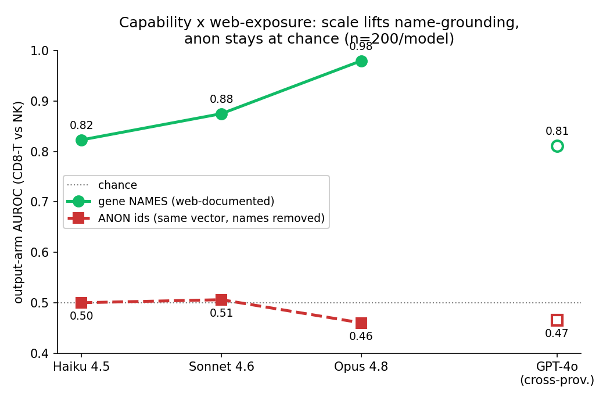

# Single-cell: the capability × web-exposure interaction

Classify **CD8-T vs NK** from a cell-sentence (top-50 genes by log-norm abundance within HVGs,
housekeeping filtered, so markers surface), in two conditions across a model capability ladder:

- **gene NAMES** — real symbols (`GZMB NKG7 GNLY PRF1 …` for NK), web-documented.
- **ANON** — global-consistent arbitrary ids (`feat_12 feat_88 …`); the expression vector is
  intact (a specialist still separates the classes, CV-AUROC **0.992**), only the human-readable
  name is removed.

Data `signal/single_cell/cd8t_nk.csv` (470 cells: 316 CD8-T, 154 NK), n=200 balanced/model.
Code: [`build_cd8t_nk.py`](../../../signal/single_cell/build_cd8t_nk.py),
[`single_cell_arm.py`](../../../eval/single_cell_arm.py), [`single_cell_figure.py`](../../../eval/single_cell_figure.py).

| model | name AUROC | anon AUROC | gap |
|---|---|---|---|
| Haiku 4.5 | 0.823 | 0.500 | 0.32 |
| Sonnet 4.6 | 0.875 | 0.506 | 0.37 |
| **Opus 4.8** | **0.980** | 0.460 | **0.52** |
| GPT-4o (cross-provider) | 0.811 | 0.465 | 0.35 |

## What it shows

- **Engine × fuel, measured.** On the within-Claude-4 capacity ladder, the gene-name line rises
  monotonically (0.823 → 0.875 → 0.980, Opus near the 0.992 specialist ceiling), while the anon
  line stays **pinned at chance at every tier** (0.50 / 0.51 / 0.46) — even Opus. Capability lifts
  grounding **only where the gene-symbol → cell-type mapping is web-documented**.
- **The gap widens with capability** (0.32 → 0.52): web-exposure and capability *multiply*, they
  are not independent main effects.
- **The anon arm is the confound control.** If Opus's name gain were just "a bigger / more recent
  training corpus," a more capable model would also do better on anon (it is better at pattern-
  finding) — but Opus is **at chance on anon**. So the gain is specifically reading web-documented
  names, not generic capability. And the 0.992 specialist ceiling shows the discriminative
  information **is** in the vector; the models simply cannot verbalize it once the names are gone.
- **Provider-invariant.** GPT-4o sits on the same curve (name 0.811, anon 0.465).

## Caveats

Pilot scale (n=200). One PBMC dataset (pbmc3k), one discrimination (CD8-T vs NK) chosen to be
non-trivial (shared cytotoxic genes → needs the symbol→type prior, not one marker; specialist
0.992 but the *named-LLM* gradient is real). The anon line at chance (vs the n=40 smoke's noisy
0.60) confirms no structural leak from sentence length/sparsity. The within-Claude-4 ladder is
the cleanest available capacity axis; GPT-4o is the cross-provider reference, the 8B foot of the
curve is in `results/SYNTHESIS.md` (the original single-cell rung).

## Next

This is the *interaction* half. The *permissioning* half (planned): pool name+anon items and show
the **a-priori web-exposure tag** (name = trust, anon = defer-to-specialist), knowable before any
model call, beats the model's **self-reported confidence** on a deferral curve — the actionable
"don't ask the model, look at web-exposure" lever (Phase 3 showed self-confidence is ~useless
per-item).
