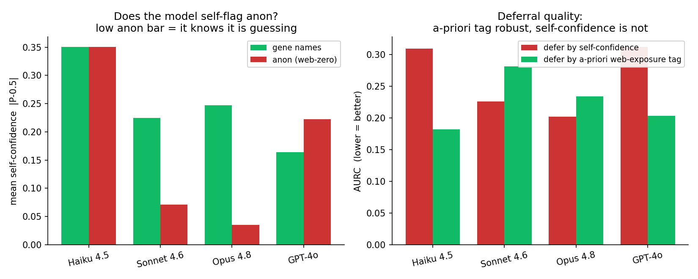

# Single-cell: the capability × web-exposure interaction

Classify **CD8-T vs NK** from a cell-sentence (top-50 genes by log-norm abundance within HVGs,
housekeeping filtered, so markers surface), in two conditions across a model capability ladder:

- **gene NAMES** — real symbols (`GZMB NKG7 GNLY PRF1 …` for NK), web-documented.
- **ANON** — global-consistent arbitrary ids (`feat_12 feat_88 …`); the expression vector is
  intact (a specialist still separates the classes, CV-AUROC **0.992**), only the human-readable
  name is removed.

Data `signal/single_cell/cd8t_nk.csv` (470 cells: 316 CD8-T, 154 NK), n=200 balanced/model.
Code: [`build_cd8t_nk.py`](../../../signal/single_cell/build_cd8t_nk.py),
[`single_cell_arm.py`](../../../eval/single_cell_arm.py), [`single_cell_figure.py`](../../../eval/single_cell_figure.py).

| model | name AUROC | anon AUROC | gap |
|---|---|---|---|
| Haiku 4.5 | 0.826 | 0.500 | 0.33 |
| Sonnet 4.6 | 0.871 | 0.504 | 0.37 |
| **Opus 4.8** | **0.978** | 0.495 | **0.48** |
| GPT-4o (cross-provider) | 0.826 | 0.460 | 0.37 |

## What it shows

- **Engine × fuel, measured.** On the within-Claude-4 capacity ladder, the gene-name line rises
  monotonically (0.826 → 0.871 → 0.978, Opus near the 0.992 specialist ceiling), while the anon
  line stays **pinned at chance at every tier** (0.50 / 0.50 / 0.50) — even Opus. Capability lifts
  grounding **only where the gene-symbol → cell-type mapping is web-documented**.
- **The gap widens with capability** (0.33 → 0.48): web-exposure and capability *multiply*, they
  are not independent main effects.
- **The anon arm is the confound control.** If Opus's name gain were just "a bigger / more recent
  training corpus," a more capable model would also do better on anon (it is better at pattern-
  finding) — but Opus is **at chance on anon**. So the gain is specifically reading web-documented
  names, not generic capability. And the 0.992 specialist ceiling shows the discriminative
  information **is** in the vector; the models simply cannot verbalize it once the names are gone.
- **Provider-invariant.** GPT-4o sits on the same curve (name 0.826, anon 0.460).

## Caveats

Pilot scale (n=200). One PBMC dataset (pbmc3k), one discrimination (CD8-T vs NK) chosen to be
non-trivial (shared cytotoxic genes → needs the symbol→type prior, not one marker; specialist
0.992 but the *named-LLM* gradient is real). The anon line at chance (vs the n=40 smoke's noisy
0.60) confirms no structural leak from sentence length/sparsity. The within-Claude-4 ladder is
the cleanest available capacity axis; GPT-4o is the cross-provider reference, the 8B foot of the
curve is in `results/SYNTHESIS.md` (the original single-cell rung).

## Permissioning: the a-priori tag vs the model's self-confidence

Pool the name + anon items and decide which to answer (trust the model) vs defer (to a specialist),
two ways: by the **a-priori web-exposure tag** (answer name, defer anon — knowable before any model
call) or by the model's **self-confidence** (|P-0.5|). Code: [`single_cell_permission.py`](../../../eval/single_cell_permission.py).

| model | conf name → anon | AURC self | AURC tag | acc@50% self | acc@50% tag |
|---|---|---|---|---|---|
| Haiku 4.5 | 0.35 → 0.35 (no self-flag) | 0.310 | **0.182** | 0.535 | **0.785** |
| Sonnet 4.6 | 0.22 → 0.07 (self-flags) | **0.226** | 0.281 | 0.745 | 0.745 |
| Opus 4.8 | 0.25 → 0.03 (self-flags) | **0.202** | 0.234 | 0.720 | 0.750 |
| GPT-4o | 0.16 → 0.22 (no self-flag) | 0.312 | **0.203** | 0.560 | **0.815** |

- **Self-confidence is capability-dependent, and that's the problem.** The well-calibrated models
  lower their confidence on anon (Opus 0.25 → 0.03, Sonnet 0.22 → 0.07) — they *know* they're
  guessing — so self-confidence routing works for them (AURC self ≤ tag). But **Haiku is equally
  confident on anon** (0.35 → 0.35) and **GPT-4o is more confident on anon** (0.16 → 0.22) —
  confidently wrong — so self-confidence collapses to ~chance (acc@50% 0.54 / 0.56).
- **The a-priori tag is uniformly safe** (acc@50% 0.75–0.82; AURC wins or ties for every model),
  because deferring a web-zero input needs no model call and never depends on the model knowing
  its own limits.
- **Conclusion (the permissioning lever):** for a *model-agnostic* "when to trust" rule, use the
  a-priori web-exposure tag, not the model's self-report — whether a model self-flags web-zero
  inputs is itself unpredictable (here, present for the well-calibrated frontier, absent for Haiku
  and GPT-4o). This refines the per-item UQ null in [`routing_arm.md`](../routing_arm.md): self-
  confidence is not just weak, it is *unreliably* weak. It also sharpens the apparent counter-
  evidence that "confidence beats input-difficulty for abstention" — it can, but only for the
  models that happen to be well-calibrated, whereas the a-priori signal is robust by construction.
