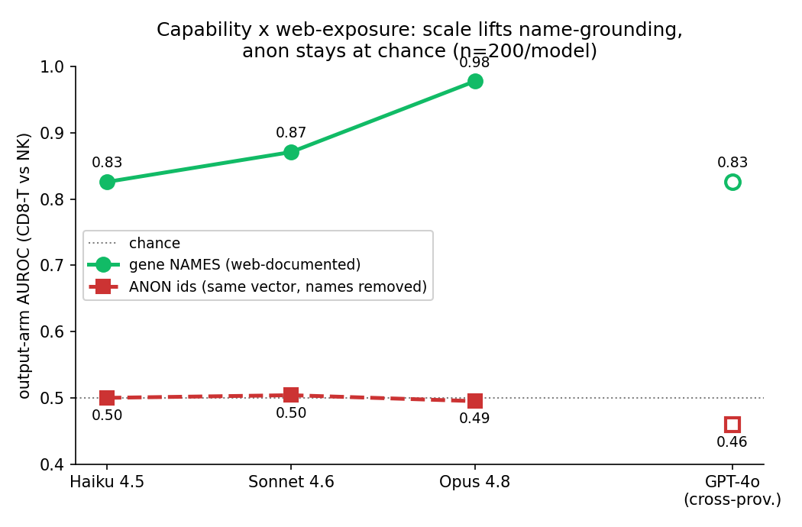
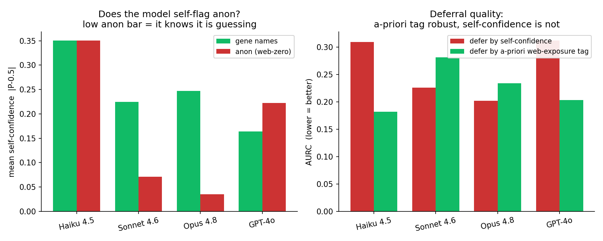

# Single-cell: the capability × web-exposure interaction

Classify a single cell from a cell-sentence (top-50 genes by log-norm abundance within HVGs,
housekeeping filtered, so markers surface), in two conditions across a model capability ladder, on
**two substrates** (so it is not cherry-picked): **CD8-T vs NK** and **CD14+ vs CD16+ monocyte** —
both pairs share lineage genes, so each needs the gene-symbol → cell-type prior, not one marker
(specialist CV-AUROC 0.992 / 0.989).

- **gene NAMES** — real symbols (`GZMB NKG7 GNLY PRF1 …` for NK), web-documented.
- **ANON** — global-consistent arbitrary ids (`feat_12 feat_88 …`); the expression vector is
  intact (the specialist still separates the classes), only the human-readable name is removed.

Data `signal/single_cell/{cd8t_nk,mono_cd14_fcgr3a}.csv`, n=200 balanced/model. Code:
[`build_cd8t_nk.py`](../../../signal/single_cell/build_cd8t_nk.py) (pair-parameterized),
[`single_cell_arm.py`](../../../eval/single_cell_arm.py), [`single_cell_figure.py`](../../../eval/single_cell_figure.py).

## Coherent open-weight Level-0 result (2026-08)

The preregistered same-forward-pass `X/Y` readout was executed on two cached Qwen2.5
sizes after freezing both 64-call plans. Both runs are
`DEVELOPMENT_READOUT_FORMAT_INVALID`: the opaque labels were the native first-token
argmax in only 3/64 (0.5B) and 6/64 (1.5B) calls, and every order, remapping, and
interaction equivalence gate failed. The dominant first token was usually `label`;
all items also failed the registered four-form range guardrail. The result localizes
the failure to this output interface and does not test cell biology or knowledge.
Per the registered stop rule, no Phase-0 power simulation or downstream activation
analysis was run. Full bilingual report and immutable artifacts:
[`coherent_readout_dev/README.md`](coherent_readout_dev/README.md).

## Paired probability discovery (2026-07)

The aggregate AUROC interaction hides a second result. A paired per-cell
decomposition across the four models and both tasks finds that gene-symbol
grounding is **graded but polarity-asymmetric**:

- all 8 model-task cells improve name-minus-anonymous AUROC, but 85.3% of the
  aggregate separation gain comes from moving comparator cells (NK or CD16+)
  away from the first answer;
- in the model-averaged CD8/NK result, names change P(CD8) by `-0.022` on true
  CD8 cells but by `-0.331` on NK cells, yielding a large ranking gain without
  a positive mean update for CD8;
- within each true class, the name-induced update tracks out-of-fold
  bag-of-gene evidence in both tasks (`rho=0.497/0.529`, Holm `p=4e-5`);
- the reference classifier actually has stronger correct-oriented margins for
  the first classes, so the comparator-dominant LLM update is not explained by
  weaker CD8 or CD14 signal under that reference.

Thus gene symbols expose graded cell-specific evidence, but AUROC alone
conflates that evidence with a class/prompt-polarity shift. This intervention
does not by itself identify training exposure, latent knowledge, or a causal
activation-to-output route.

Full analysis: [`semantic_alignment.md`](semantic_alignment.md), generated by
[`analyze_single_cell_semantic_alignment.py`](../../../eval/analyze_single_cell_semantic_alignment.py).

### Prompt-role reversal follow-up

The answer roles were then reversed on the exact same 200 cells for Haiku 4.5,
rerunning both name and anonymous arms and converting reported P(B) back to
P(A). The original class asymmetry flips:

- CD8/NK correct shifts: `-0.073 / +0.487` forward versus
  `+0.327 / +0.018` reversed;
- monocyte correct shifts: `+0.060 / +0.221` forward versus
  `+0.595 / -0.051` reversed.

Across both tasks, order-averaged correct grounding remains positive
(`+0.190/+0.206`), and the forward/reverse within-class item updates remain
positively correlated (`rho=0.472/0.358`). But the prompt-role contrast is much
larger and consistently favors the second role (`-0.434/-0.404`, both paired
95% intervals excluding zero).

The mechanism is visible in the anonymous arm: Haiku assigns `0.85` to whichever
class is queried first for 97.5-100% of cells in both orientations. Gene symbols
primarily correct this high, input-insensitive default, leaving much more
headroom for a correct update toward the second class. The finding is therefore
**graded semantic correction plus prompt-role prior**, not uniform cell-class
grounding.

This two-form swap bundles list order with the queried probability target. A
pure list-position test must cross order (`A/B`, `B/A`) with queried target
(`P(A)`, `P(B)`) and rerun all four forms contemporaneously. Pilot result:
[`orientation_swap/claude-haiku-4-5-20251001.md`](orientation_swap/claude-haiku-4-5-20251001.md),
generated by
[`single_cell_orientation_swap.py`](../../../eval/single_cell_orientation_swap.py).

### External-cohort marker-program intervention

The historical `P(CD8)` label below denotes an aligned target-conditioned
score unless that run separately passes complement and remapping coherence.
The later raw audit directly covers only the GSE96583 parent and sentinel
runs; the PBMC68k experiments require their own audit. Their paired
within-form token-deletion contrasts remain descriptive interface effects.

That biology-facing experiment is now complete for one external cohort. A
label-matched CD8 or NK marker program frozen from the pre-existing PBMC3k builder was
masked in 119 independently annotated PBMC68k CD8/NK cells. The paired control
masked the same number of source-neutral genes matched within each cell, and
both arms were crossed with all four answer-order × queried-target forms.

- 952/952 calls parsed successfully;
- equal-class control-adjusted program effect:
  `+0.294 [+0.256, +0.332]`, sign-flip `p=2e-5`;
- CD8: `+0.123 [+0.096, +0.152]`; NK:
  `+0.466 [+0.394, +0.536]`;
- 108/119 cell-level paired effects were positive; the NK half supplies 79%
  of the equal-class effect and is dominated descriptively by co-masked
  `GNLY`/`NKG7`/`GZMB`;
- strict matching subset: `+0.287 [+0.225, +0.345]`, n=99;
- all four form-specific effects were positive, but the preregistered
  `±0.03` prompt-equivalence gate failed.

This is evidence that the model's correct-class output depends specifically
on recognizable label-matched marker-program tokens in one external cohort,
beyond the matched deletion control. The operational NK program includes both
NK-associated and cytotoxic-effector genes, so the result does not yet isolate
lineage identity from cell state. It is not an unassisted annotation result
because the reference label selects the program, and it is not hidden-state
causality, multi-donor generalization, training-exposure identification, or a
physical law.

Preregistration:
[`PBMC68K_PROGRAM_MASK_PREREG.md`](../../../docs/PBMC68K_PROGRAM_MASK_PREREG.md).
Result:
[`program_mask_transfer/claude-haiku-4-5-20251001.md`](program_mask_transfer/claude-haiku-4-5-20251001.md),
generated by
[`single_cell_program_mask_transfer.py`](../../../eval/single_cell_program_mask_transfer.py).

### Within-frame label-blind module comparison

The follow-up removed reference-label selection of the intervention within the
already label-defined CD8/NK task frame. Common support required both
operational categories, and every one of the 65 mixed-marker cells received a
highest-ranked TCR/CD8-category mask, a highest-ranked
cytotoxic/NK-enriched-category mask, each category's separately matched neutral
mask, an unmasked condition, and all four answer-order × queried-target forms.

- 1,256 unique model calls produced 1,300 logical observations with 100% parse
  success;
- TCR/CD8 effect on the aligned CD8 score: `+0.073 [0.033, 0.118]`;
- cytotoxic/NK-enriched effect on the aligned CD8 score:
  `-0.214 [-0.289, -0.132]`;
- the joint directional gate passed (`IUT p=0.00444`), and the between-category
  separation was `+0.287 [0.194, 0.374]`;
- neutral deletions stayed near the unmasked condition, and strict matching
  strengthened the separation to `+0.322 [0.238, 0.405]` (n=61);
- both directions held in all four prompt forms, but the `±0.03`
  prompt-equivalence gate failed.

Post-hoc localization does not support a generic cytotoxic-program
interpretation. Cells whose selected target was `GNLY` descriptively account
for 88.5% of the signed equal-class aggregate; the `NKG7`-targeted stratum
accounts for 14.1%. Small opposing contributions in `CCL5`- and
`GZMK`-targeted contexts make the shares sum above 100%. These are
context-confounded target strata, not isolated gene effects. `GNLY` and `NKG7`
are NK associated but not NK-lineage-specific.

The localization is strongly state dependent. Within the `GNLY`-targeted
stratum, effects were `-0.386` in NK (n=7), `-0.397` in cytotoxic CD8 (n=15),
and only `-0.013` in naive CD8 (n=2). Only 18/65 cells had both module effects
in the expected directions, although T-minus-cytotoxic separation was positive
in 54/65. Only seven raw score values were emitted, and 75.2% of calls were
exactly `0.15` or `0.85`. This is compatible with a coarse category-switch
output but does not identify an evidence-integration mechanism.

The bounded finding is therefore **asymmetric, context-dependent token-deletion
sensitivity concentrated in GNLY/NKG7-selected strata—a candidate NK-label
lexical-cue effect in this binary task—alongside a weaker CD3/TCR-associated
score effect** in one mixed-marker subset, donor, and model. CD3/TCR is
T-lineage evidence here, not uniquely CD8-specific biology. This is causal
token sensitivity at the text interface and a testable evidence-competition
hypothesis—not individual-gene or pathway causality, hidden-state activation,
latent knowledge, prompt invariance, or a physical law. The task frame and
source neutral-gene filter remain label informed.

Preregistration:
[`PBMC68K_MODULE_FACTORIAL_PREREG.md`](../../../docs/PBMC68K_MODULE_FACTORIAL_PREREG.md).
Primary result:
[`module_factorial/claude-haiku-4-5-20251001.md`](module_factorial/claude-haiku-4-5-20251001.md).
Descriptive localization:
[`module_factorial/discovery_localization.md`](module_factorial/discovery_localization.md).
Code:
[`single_cell_module_factorial.py`](../../../eval/single_cell_module_factorial.py) and
[`analyze_single_cell_module_discovery.py`](../../../eval/analyze_single_cell_module_discovery.py).
The immutable generated primary report's heading “Primary mechanistic result”
is a terminology error; read it as “Primary intervention result.”

## GSE96583 eight-donor registered-score replication

The donor-aware extension used 56 hash-selected cells from eight unstimulated
SLE donors and 1,120 exactly parsed Haiku calls. Expression support—not the
deposited same-expression cell label—selected two paired contexts.

- Gate A replicated the TCR/CD8-versus-cytotoxic opposition:
  TCR/CD8 `+0.114 [+0.093,+0.136]` and cytotoxic
  `-0.065 [-0.127,-0.002]`; exact IUT `p=0.01953125`.
- Gate B failed: the receptor aggregate was negative
  (`-0.053 [-0.086,-0.019]`) but only 6/8 donor effects were strictly
  negative, below the preregistered 7/8 rule. The paired cytotoxic component
  passed in 8/8 donors.
- Prompt invariance and neutral-sham equivalence were not established.
- Post-hoc localization again found a large `GNLY`-selected effect and an
  approximately null `CCL5`-selected effect. These expression-selected,
  context-confounded strata generated a sparse-cue hypothesis; they did not
  establish a hierarchy, homogeneous program contrast, or individual-gene
  causal claim.

A later raw-only audit found the same readout defect in this parent run:
only `166/560` direct complementary query pairs were within `±0.03` of summing
to one (mean absolute residual `0.291`). The form-specific deletion contrasts
remain descriptive model-output effects, but their four-form average is not a
coherent P(CD8) estimate.

Preregistration:
[`GSE96583_CONTEXT_MODULE_PREREG.md`](../../../docs/GSE96583_CONTEXT_MODULE_PREREG.md).
Generated result:
[`donor_context_factorial/claude-haiku-4-5-20251001.md`](donor_context_factorial/claude-haiku-4-5-20251001.md).
Post-run bilingual interpretation:
[`donor_context_factorial/POSTRUN_DISCOVERY.md`](donor_context_factorial/POSTRUN_DISCOVERY.md).
Raw-recomputed target localization:
[`donor_context_factorial/discovery_localization.md`](donor_context_factorial/discovery_localization.md).
Code:
[`single_cell_donor_context_factorial.py`](../../../eval/single_cell_donor_context_factorial.py)
and
[`analyze_gse96583_context_discovery.py`](../../../eval/analyze_gse96583_context_discovery.py).

## Held-out GNLY/NKG7/CCL5 sentinel factorial

The prospective follow-up used one entirely new triple-positive cell from each
of the same eight donors. Every cell received all seven nonempty sentinel
subsets, the corresponding nested matched-control subsets, the unmasked
condition, and all four answer-order × queried-target forms (`480/480` exact
parses).

- The registered canonical GNLY anchor failed: control-adjusted and absolute
  effects were both `-0.0125 [-0.0421,+0.0171]`, with only 1/8 donors beyond
  the `-0.03` materiality margin. Each GNLY component's shifted exact
  `p=0.88671875`; the four-component dual-scale anchor-gate IUT was `p=1`.
- The full triple moved in the opposite aggregate direction (`+0.0750`), and
  the NKG7+CCL5 increment after GNLY was `+0.0875`; neither effect was material
  negative or equivalent to zero.
- Consequently, neither one-token nor multi-token output dependence was
  established. The registered donor-recurrent material-effect rule was not
  met, while absence and equivalence remain unresolved.

The identical aggregate `r(GNLY)` and `a(GNLY)` values do not represent
per-donor convergence. The sole negative `r(GNLY)` came from donor 1039 and
was caused by its GAPDH control-mask movement; the sole negative `a(GNLY)`
came from donor 107 under target masking. Target-erasure-specific wording is
therefore prohibited.

The stronger post-hoc discovery concerns the readout itself. On the same
rendered input, `407/480` replies assigned at least `0.75` to whichever class
was queried. Only `18/240` complementary query pairs were within `±0.03` of
summing to one (AB `16/120`; BA `2/120`); all `120/120` cell-condition inputs
(8 cells × 15 conditions) changed across the four forms, and 479/480 raw
answers occupied four response plateaus. These are target-conditioned,
order-sensitive scores rather than coherent binary probabilities in this
model/template/run. The same defect was present, though weaker, in the parent
experiment (`166/560` coherent complementary pairs). Thus prompt-form averaging
cannot rescue or mechanistically interpret the failed registered endpoint.

Preregistration:
[`GSE96583_SENTINEL_FACTORIAL_PREREG.md`](../../../docs/GSE96583_SENTINEL_FACTORIAL_PREREG.md).
Registered result:
[`sentinel_factorial/claude-haiku-4-5-20251001.md`](sentinel_factorial/claude-haiku-4-5-20251001.md).
Raw-only post-hoc audit:
[`sentinel_factorial/posthoc_interface_discovery.md`](sentinel_factorial/posthoc_interface_discovery.md).
Code:
[`single_cell_sentinel_factorial.py`](../../../eval/single_cell_sentinel_factorial.py) and
[`analyze_gse96583_sentinel_posthoc.py`](../../../eval/analyze_gse96583_sentinel_posthoc.py).
Next design (confirmatory execution `NO-GO` pending an orthogonal cohort):
[`COHERENT_BINARY_READOUT_DESIGN.md`](../../../docs/COHERENT_BINARY_READOUT_DESIGN.md).

| CD8-T vs NK | name AUROC | anon AUROC | gap | | CD14+ vs CD16+ mono | name | anon | gap |
|---|---|---|---|---|---|---|---|---|
| Haiku 4.5 | 0.826 | 0.500 | 0.33 | | Haiku 4.5 | 0.763 | 0.505 | 0.26 |
| Sonnet 4.6 | 0.871 | 0.504 | 0.37 | | Sonnet 4.6 | 0.929 | 0.516 | 0.41 |
| **Opus 4.8** | **0.978** | 0.495 | **0.48** | | **Opus 4.8** | **0.983** | 0.500 | **0.48** |
| GPT-4o | 0.826 | 0.460 | 0.37 | | GPT-4o | 0.748 | 0.480 | 0.27 |

## What it shows

- **Engine × fuel, measured — and it generalizes.** On the within-Claude-4 capacity ladder the
  gene-name line rises monotonically on **both** substrates (CD8-T/NK 0.826 → 0.871 → 0.978;
  monocyte 0.763 → 0.929 → 0.983, Opus near the 0.992 / 0.989 specialist ceilings), while the anon
  line stays **pinned at chance at every tier** (CIs straddle 0.5) — even Opus. Capability lifts
  grounding **only where the gene-symbol → cell-type mapping is web-documented**, on two
  independent cell-type pairs.
- **The gap widens with capability** (0.33 → 0.48): web-exposure and capability *multiply*, they
  are not independent main effects.
- **The anon arm is the confound control.** If Opus's name gain were just "a bigger / more recent
  training corpus," a more capable model would also do better on anon (it is better at pattern-
  finding) — but Opus is **at chance on anon**. So the gain is specifically reading web-documented
  names, not generic capability. And the 0.992 specialist ceiling shows the discriminative
  information **is** in the vector; the models simply cannot verbalize it once the names are gone.
- **Provider-invariant.** GPT-4o sits on the same curve (name 0.826, anon 0.460).

## Caveats

Pilot scale (n=200). One PBMC dataset (pbmc3k), one discrimination (CD8-T vs NK) chosen to be
non-trivial (shared cytotoxic genes → needs the symbol→type prior, not one marker; specialist
0.992 but the *named-LLM* gradient is real). The anon line at chance (vs the n=40 smoke's noisy
0.60) confirms no structural leak from sentence length/sparsity. The within-Claude-4 ladder is
the cleanest available capacity axis; GPT-4o is the cross-provider reference, the 8B foot of the
curve is in `results/SYNTHESIS.md` (the original single-cell rung).

The external program-mask experiment above partially lifts the one-cohort
boundary for output dependence. The within-frame module comparison removes
per-cell reference-label selection of the mask and common-support rule, but
PBMC68k is still one donor, the CD8/NK task frame and source neutral filter are
label informed, and the common-support subset is deliberately enriched for
mixed markers. Neither experiment supplies multi-donor replication or replaces
a fully label-blind annotation benchmark.

## The third arm: encode vs verbalize (open-weight probe)

To check the "encoded equally" premise on an LLM's own activations (not only the cheap specialist),
we ran the 3-arm on an open model (Qwen2.5-0.5B-Instruct, local MPS;
[`eval/activation_arm_sc.py`](../../../eval/activation_arm_sc.py), CD8-T/NK, n=200): a probe on the
last-token hidden state (ACTIVATION) vs the model's verbalized output (OUTPUT), against the
bag-of-tokens surface and the 0.992 specialist.

| condition | surface (bag-of-tokens) | activation (probe) | output (verbalize) | enc gap | exp gap |
|---|---|---|---|---|---|
| gene names | 0.987 | 0.947 | 0.461 | 0.045 | **0.486** |
| anon | 0.987 | 0.764 | 0.433 | 0.228 | 0.331 |

- **encode ≫ verbalize, measured directly.** On names the small model encodes cell type near the
  ceiling (activation 0.947) yet verbalizes at chance (output 0.461): a 0.49 expression gap. The
  information is in the activations; the model just cannot say it. The 0.461 is the *foot* of the
  name-verbalization curve (0.5B 0.46 → Haiku 0.83 → Opus 0.98 above): the signal was encoded all
  along, and capacity learns to read it out.
- **The signal is equally present in the input** (bag-of-tokens 0.987 for both name and anon), so the
  name/anon contrast isolates web-exposure, not information content.
- **anon: encoded above its output (0.764 > 0.433) but not yet equal to names** at 0.5B; full
  activation-equality (anon ≈ name) is a bigger-model property (the 8B reaches anon 0.964 ≈ name 0.983
  in [`SYNTHESIS.md`](../../SYNTHESIS.md)). So deep encoding *also* improves with scale, while
  verbalization of the web-zero form never does: the encode−verbalize gap for web-zero is permanent.

## Permissioning: the a-priori tag vs the model's self-confidence

Pool the name + anon items and decide which to answer (trust the model) vs defer (to a specialist),
two ways: by the **a-priori web-exposure tag** (answer name, defer anon — knowable before any model
call) or by the model's **self-confidence** (|P-0.5|). Code: [`single_cell_permission.py`](../../../eval/single_cell_permission.py).

| model | conf name → anon | AURC self | AURC tag | acc@50% self | acc@50% tag |
|---|---|---|---|---|---|
| Haiku 4.5 | 0.35 → 0.35 (no self-flag) | 0.310 | **0.182** | 0.535 | **0.785** |
| Sonnet 4.6 | 0.22 → 0.07 (self-flags) | **0.226** | 0.281 | 0.745 | 0.745 |
| Opus 4.8 | 0.25 → 0.03 (self-flags) | **0.202** | 0.234 | 0.720 | 0.750 |
| GPT-4o | 0.16 → 0.22 (no self-flag) | 0.312 | **0.203** | 0.560 | **0.815** |

- **Self-confidence is capability-dependent, and that's the problem.** The well-calibrated models
  lower their confidence on anon (Opus 0.25 → 0.03, Sonnet 0.22 → 0.07) — they *know* they're
  guessing — so self-confidence routing works for them (AURC self ≤ tag). But **Haiku is equally
  confident on anon** (0.35 → 0.35) and **GPT-4o is more confident on anon** (0.16 → 0.22) —
  confidently wrong — so self-confidence collapses to ~chance (acc@50% 0.54 / 0.56).
- **The a-priori tag is uniformly safe** (acc@50% 0.75–0.82; AURC wins or ties for every model),
  because deferring a web-zero input needs no model call and never depends on the model knowing
  its own limits.
- **Conclusion (the permissioning lever):** for a *model-agnostic* "when to trust" rule, use the
  a-priori web-exposure tag, not the model's self-report — whether a model self-flags web-zero
  inputs is itself unpredictable (here, present for the well-calibrated frontier, absent for Haiku
  and GPT-4o). This refines the per-item UQ null in [`routing_arm.md`](../routing_arm.md): self-
  confidence is not just weak, it is *unreliably* weak. It also sharpens the apparent counter-
  evidence that "confidence beats input-difficulty for abstention" — it can, but only for the
  models that happen to be well-calibrated, whereas the a-priori signal is robust by construction.
